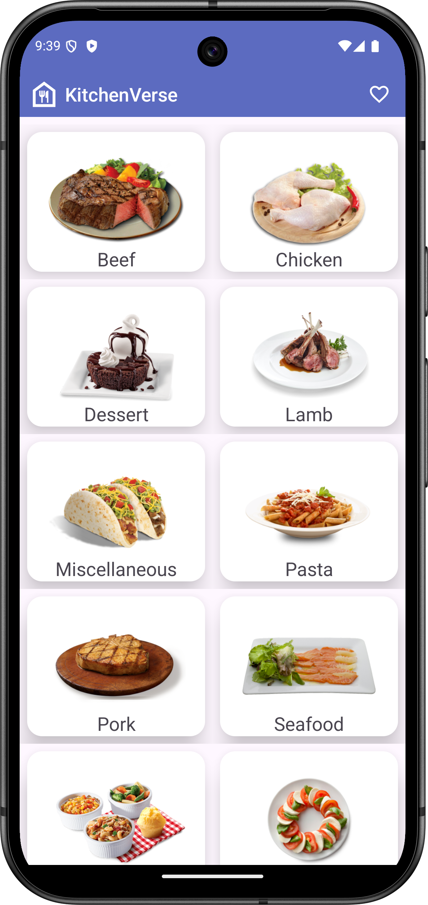
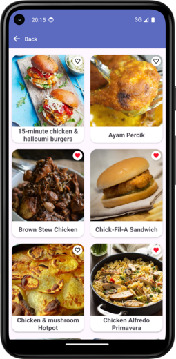
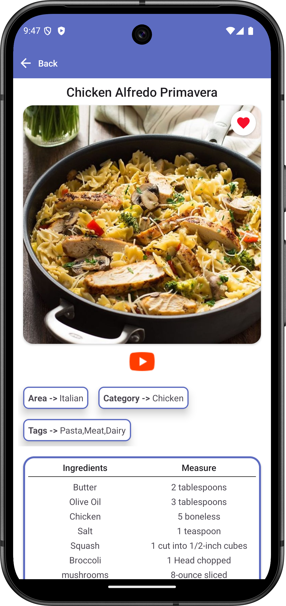
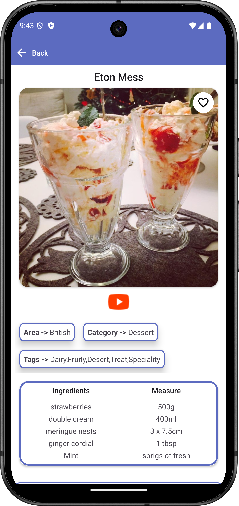
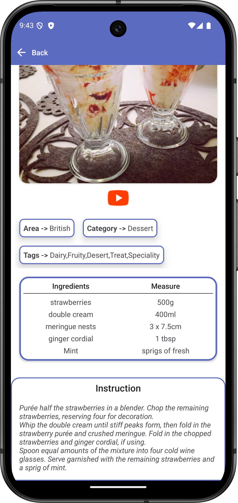
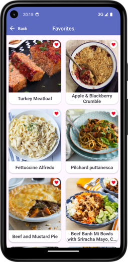

# 🍽️ KitchenVerse

## 📌 Tech Stack
- **Clean Architecture** – Layered architecture for a scalable, testable, and maintainable codebase
- **Room Database** – Local database to store and manage favorite meals
- **Navigation Component** – Single activity multiple fragments approach
- **Retrofit** – API client used to fetch meal categories and meal data from TheMealDB
- **ViewModel & Flow** – Reactive data handling for UI state management
- **Hilt (DI)** – Simplifies dependency management for a modular codebase
- **ViewBinding** – Easy and type-safe access to XML layout views

## 📄 Project Overview

**KitchenVerse** is a food recipe app that allows users to browse meal categories, view meals under each category, and explore detailed information about each meal. Users can also add meals to their favorites and access them later in a separate screen.

- On the **Home screen**, users see a list of food categories.
- By selecting a category, users are navigated to a screen that lists meals under that category.
- Clicking a meal displays its **details**, including name, origin, category, recipe, tags, and YouTube link.
- Users can **add or remove meals from favorites**.
- A **Favorites screen** allows users to view and manage their saved meals.

## 📸 Screenshots

> Screenshots are stored in the `images/` directory for better organization.